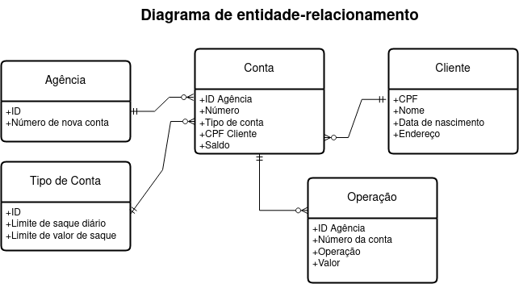

# dio-ciencia-de-dados-com-python-sistema-bancario

Projeto de desenvolvimento de um sistema bancário presente no módulo "Dominando o Python Para Ciência de Dados" do bootcamp [Potência Tech powered by iFood | Ciência de Dados com Python](https://www.dio.me/bootcamp/potencia-tech-powered-ifood-ciencias-de-dados-com-python) utilizando apenas conceitos já ensinados (modularização e POO, por exemplo, ainda não foram ensinados).

